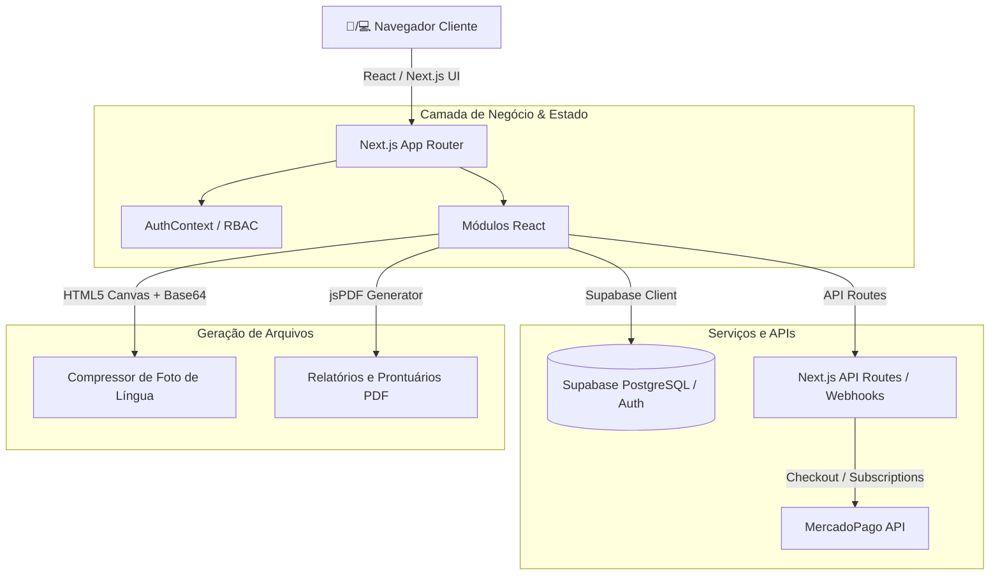

# 📚 Wiki Técnica & Guia de Arquitetura - Axis GC (Eliza Oliver)

O **Axis GC** é uma plataforma SaaS completa de gestão clínica especializada em **Medicina Tradicional Chinesa (MTC), Acupuntura, Terapias Integrativas e Saúde Geral**. O sistema oferece gestão de prontuários eletrônicos, fichas de avaliação clínica multinível (com diagnóstico de pulso, língua e radiestesia), agendamento de consultas, faturamento, estoque de fitoterápicos/insumos e controle financeiro com assinaturas recorrentes via MercadoPago.

---

## 🛠️ Tech Stack & Arquitetura Geral

| Camada | Tecnologia | Descrição |
|---|---|---|
| **Framework Web** | Next.js 15 (App Router) | Renderização híbrida (Server Components / Client Components) |
| **Linguagem** | TypeScript | Tipagem estática rigorosa para domínio clínico e financeiro |
| **Estilização** | Tailwind CSS + Vanilla CSS | Design moderno, responsivo, dark/light contrast |
| **Banco de Dados & Autenticação** | Supabase (PostgreSQL + Auth) | Autenticação via JWT, Row Level Security (RLS) e suporte a modo offline local |
| **Animações & Ícones** | Framer Motion & Lucide React | Transições de tela suaves e micro-interações |
| **Geração de Documentos** | jsPDF + autoTable | Exportação e impressão de prontuários em PDF com imagens |
| **Pagamentos / SaaS** | MercadoPago SDK / Webhooks | Checkout transparente e gestão de planos de assinatura |

---

## 🏗️ Diagrama de Arquitetura (Mermaid)



---

## 🎓 Guia de Introdução & Onboarding (Zero to Hero)

### 1. Pré-requisitos
- Node.js `v18.x` ou superior
- Gerenciador de pacotes `npm`
- Conta no **Supabase** (para ambiente de nuvem) e **MercadoPago Developer**

### 2. Configuração de Variáveis de Ambiente (`.env.local`)
```env
NEXT_PUBLIC_SUPABASE_URL=https://<seu-projeto>.supabase.co
NEXT_PUBLIC_SUPABASE_ANON_KEY=<sua-anon-key>
SUPABASE_SERVICE_ROLE_KEY=<sua-service-role-key>

NEXT_PUBLIC_MERCADOPAGO_PUBLIC_KEY=<sua-public-key-mp>
MERCADOPAGO_ACCESS_TOKEN=<seu-access-token-mp>
MERCADOPAGO_WEBHOOK_SECRET=<seu-webhook-secret>
```

### 3. Rodando Localmente
```bash
# Instalar dependências
npm install

# Iniciar servidor de desenvolvimento
npm run dev

# Compilar para produção
npm run build
```

---

## 🧩 Detalhamento dos Módulos Principais

### 1. 📋 Módulo de Avaliações Clínicas ([components/EvaluationsView.tsx](file:///d:/Projetos%20antigravity/ElizaOliver/elizaoliver/components/EvaluationsView.tsx))
- **Ficha Diagnóstico de Ouro MTC (7 Páginas)**:
  - **Pág 1**: Queixa Principal, Intensidade (EVA 0-10), Localização e Características da Dor.
  - **Pág 2**: Termorregulação (Frio/Calor), Transpiração, Sede e Fome.
  - **Pág 3**: Micção, Evacuação e Escala de Bristol.
  - **Pág 4**: Padrões de Diarreia, Emoção Predominante, Insônia e Sonolência.
  - **Pág 5**: Ginecologia Detalhada, Saúde Masculina e Inspeção do Shen (Coloração Facial, Lábios, Olhos, etc.).
  - **Pág 6**: Exame Físico de Pulso (Direito/Esquerdo/Profundidade/BPM) e Língua + **Foto da Língua com Câmera do Celular ou Upload**.
  - **Pág 7**: **Resumo Consolidado dos Achados Clínicos (Páginas 1 a 6)** + Fechamento da **Síndrome MTC Identificada**, Técnicas e Pontos Utilizados.
- **Ficha MTC Padrão**: Avaliação simplificada de Zang-Fu, Pulso e Língua.
- **Ficha de Radiestesia & Modelos Personalizados**: Suporte a modelos customizáveis (`types/evaluationTemplate.ts`).

### 2. 👥 Módulo de Pacientes ([components/PatientsView.tsx](file:///d:/Projetos%20antigravity/ElizaOliver/elizaoliver/components/PatientsView.tsx), [components/PatientModal.tsx](file:///d:/Projetos%20antigravity/ElizaOliver/elizaoliver/components/PatientModal.tsx))
- Cadastro completo de prontuários com dados pessoais, contatos de emergência, anamnese, histórico de hábitos e restrições.
- Histórico integrado de todas as consultas, evoluções e fichas de avaliação realizadas para o paciente.

### 3. 📅 Módulo de Agenda ([components/CalendarView.tsx](file:///d:/Projetos%20antigravity/ElizaOliver/elizaoliver/components/CalendarView.tsx), [components/ConsultationModal.tsx](file:///d:/Projetos%20antigravity/ElizaOliver/elizaoliver/components/ConsultationModal.tsx))
- Agendamento interativo de consultas com filtro por profissional, status (Agendado, Confirmado, Concluído, Cancelado).
- Disparo automático / facilitação de mensagens pelo **WhatsApp Web** (`lib/whatsapp.ts`).

### 4. 💰 Módulo Financeiro & Faturamento ([components/FinancialView.tsx](file:///d:/Projetos%20antigravity/ElizaOliver/elizaoliver/components/FinancialView.tsx), [components/BillingView.tsx](file:///d:/Projetos%20antigravity/ElizaOliver/elizaoliver/components/BillingView.tsx))
- Controle de receitas, despesas, fluxo de caixa diário/mensal e formas de pagamento.
- **Gestão SaaS de Planos**: Assinaturas de clínicas via integração MercadoPago (`app/api/mercadopago/checkout`).

### 5. 📦 Módulo de Estoque ([components/InventoryView.tsx](file:///d:/Projetos%20antigravity/ElizaOliver/elizaoliver/components/InventoryView.tsx))
- Controle de insumos (agulhas, moxa, ventosas, óleos) e fitoterápicos/fórmulas chinesas.
- Alertas automáticos de estoque baixo (`LowStockAlertModal.tsx`).

### 6. 🔐 Módulo de Usuários, RBAC & Auditoria ([components/UsersManagementView.tsx](file:///d:/Projetos%20antigravity/ElizaOliver/elizaoliver/components/UsersManagementView.tsx), [lib/rbac.tsx](file:///d:/Projetos%20antigravity/ElizaOliver/elizaoliver/lib/rbac.tsx))
- Níveis de permissão granulados (Administrador, Profissional de Saúde, Recepção).
- Registros de auditoria (`AuditLogsView.tsx`, `lib/auditLogService.ts`) para rastreabilidade de criação/edição/exclusão de prontuários.

### 7. 🎨 Módulo de Configurações da Clínica & Branding ([lib/clinicService.ts](file:///d:/Projetos%20antigravity/ElizaOliver/elizaoliver/lib/clinicService.ts), [components/SettingsView.tsx](file:///d:/Projetos%20antigravity/ElizaOliver/elizaoliver/components/SettingsView.tsx))
- Personalização de Nome da Clínica, Subtítulo, Endereço, Telefone Comercial e Upload de LOGO.
- Sincronização automática na página pública de pré-agendamento (`/pre-agendamento`), TopBar e Sidebar.
- Guia técnico e especificações de imagem: [docs/MANUAL_CONFIGURACOES_E_LOGO.md](file:///d:/Projetos%20antigravity/ElizaOliver/elizaoliver/docs/MANUAL_CONFIGURACOES_E_LOGO.md).

---

## 📄 Estrutura de Arquivos Relevantes

```
elizaoliver/
├── app/                        # Next.js App Router (Páginas e API Routes)
│   ├── (auth)/login/           # Tela de Login
│   ├── (dashboard)/            # Dashboard e sub-rotas
│   └── api/                    # Webhooks MercadoPago e utilitários server-side
├── components/                 # Componentes React de UI e visões do sistema
│   ├── EvaluationsView.tsx     # Gerenciamento e formulário de fichas de avaliação
│   ├── PatientsView.tsx        # Lista e busca de pacientes
│   ├── FinancialView.tsx       # Controle financeiro e lançamentos
│   ├── CalendarView.tsx        # Agenda clínica
│   └── ...
├── lib/                        # Clientes e serviços utilitários
│   ├── supabase.ts             # Cliente do Supabase e rotinas offline
│   ├── mercadopago.ts          # Utilitários de pagamento MercadoPago
│   └── rbac.tsx                # Controle de acesso baseado em roles/permissões
└── types/                      # Definições de tipos TypeScript
    ├── evaluations.ts          # Interfaces do Diagnóstico de Ouro, MTC e Foto da Língua
    └── auth.ts                 # Tipagem de usuários e permissões
```

---

## 📌 Guia de Manutenção e Boas Práticas

1. **Alterações em Fichas de Avaliação**:
   - Ao adicionar um campo novo no Diagnóstico de Ouro, atualize o tipo em `types/evaluations.ts`, a inicialização em `DIAGNOSTICO_OURO_DEFAULT_FORM_DATA`, o formulário no `EvaluationsView.tsx` e o gerador de PDF em `handleExportEvaluation`.
2. **Compressão de Imagens**:
   - Imagens enviadas via upload ou câmera (como a foto da língua) devem passar pela função `processAndCompressImage` para garantir alta resolução em arquivo leve JPEG Base64.
3. **Validação de Compilação**:
   - Sempre execute `npm run build` após modificar telas para garantir zero erros de tipagem ou exportação.
